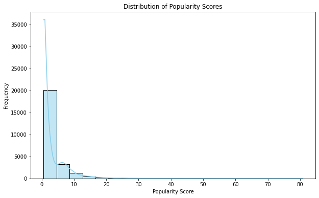
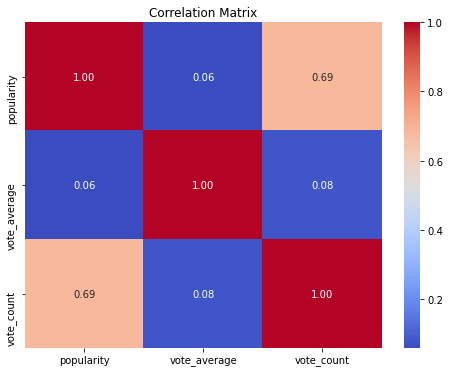

# Microsoft-movies-studio

## Author: Claudia Sagini

## Overview
Microsoft's movie studio aims to leverage insights from The Movie Database (TMDb) to optimize audience engagement and enhance movie success. Utilizing exploratory data analysis and correlation analysis, the project delves into vote counts, popularity scores, and other variables to uncover actionable trends. Findings underscore the pivotal role of vote counts and popularity in driving movie success, leading to recommendations that prioritize audience engagement, capitalize on popularity drivers, and refine marketing strategies to bolster competitiveness in the film industry.

Key Points:

* Objective: Understand audience engagement and movie success.
* Data Source: The Movie Database (TMDb).
* Methods: Exploratory data analysis and correlation analysis.
* Findings: Vote counts and popularity crucial for success.
* Recommendations: Prioritize audience engagement, leverage popularity drivers, optimize marketing strategies.


## Business Understanding
Microsoft's movie studio aims to thrive in the highly competitive film industry by understanding audience preferences and optimizing content creation and marketing strategies. To address this objective, the studio seeks insights into factors contributing to audience engagement and movie success. Analyzing data from The Movie Database (TMDb), the studio aims to answer key questions:

* What factors contribute to audience engagement and movie success?
* How do vote counts and popularity scores correlate with movie performance?
* What insights can be gained from analyzing the relationship between these factors?

These questions are crucial for Microsoft's movie studio as they provide valuable insights into audience preferences and the effectiveness of marketing strategies.


## Data
* The primary dataset is sourced from The Movie Database (TMDb), providing extensive information on movies, including titles, genres, studios, and audience ratings. Additionally, supplementary datasets from Box Office Mojo and IMDb may complement the analysis by offering financial performance metrics and additional movie details.

* These datasets encompass a wide range of movies across various genres and release years.
* Key variables include vote counts, popularity scores, and average ratings.

The target variable for analysis is audience engagement metrics like vote counts and popularity scores.

## Methods
### Data Preparation: 
The analysis commenced with data cleaning and preprocessing using Python and libraries such as:
```import pandas as pd
    import matplotlib.pyplot as plt
    import seaborn as sns
    import numpy as np

    % matplotlib inline
```
Missing values were handled by imputation or removal, while outliers were identified and addressed using statistical techniques. Duplicates were also removed to ensure data integrity.
For example, to handle missing values, the following code was used:

```tmdb_df.dropna(inplace=True)```

### Descriptive Analysis: 
* Descriptive statistics, data visualization, and correlation analysis were conducted to explore the dataset's characteristics. Matplotlib and Seaborn were utilized for visualizations, enabling the creation of histograms, scatter plots, and heatmaps to understand the distribution and relationships between variables. For instance, to create a histogram of vote counts:
```
plt.figure(figsize=(10, 6))
sns.histplot(tmdb_df['vote_count'], bins=20, kde=True, color='salmon')
plt.title('Distribution of Vote Counts')
plt.xlabel('Vote Count')
plt.ylabel('Frequency')
plt.show()
```
* This approach is deemed suitable for Phase 1 of the analysis as it provides a comprehensive understanding of the dataset's characteristics and distributions. By employing descriptive analysis techniques, such as summary statistics and visualizations, we can uncover insights into audience engagement and movie success factors, laying the groundwork for further analysis and modeling in subsequent phases.


## Results

### Distribution of Vote Counts: 
The distribution of vote counts is right-skewed, indicating that most movies have lower vote counts, with a few outliers receiving significantly higher votes, suggesting varying audience engagement.


### Distribution of Popularity Scores: 
Popularity scores show variability, with a long tail indicating highly popular movies. This suggests that certain movies attract significantly more attention from audiences than others. 



### Correlation Analysis: 
The correlation matrix reveals a moderate positive correlation (0.685) between popularity and vote count, indicating that highly popular movies tend to receive more votes. However, correlations with other variables, like vote average, are relatively weak, suggesting nuanced relationships requiring further exploration. 



### Interpretation of Results:
* These findings offer insights into audience engagement and preferences, informing decision-making for Microsoft's movie studio. Understanding vote count and popularity trends helps identify audience behavior, while correlations highlight potential factors influencing movie success.

* While based on the provided dataset, these patterns and relationships may generalize to similar movie datasets. However, caution is advised when extrapolating findings to other contexts due to the complexity of the movie industry.

## Recommendations
### Invest in Audience Engagement:
Prioritize content creation strategies that drive high audience engagement, focusing on genres or themes that resonate with specific demographics.

### Emphasize Popularity Drivers: 
Identify key factors contributing to the popularity of highly successful movies and incorporate them into content creation and marketing campaigns.

### Optimize Marketing Efforts: 
Capitalize on the relationship between popularity and vote count by investing in targeted advertising campaigns and social media promotions.

## Conclusion

### 1.Recommendations for the Business:

* Invest in genres or themes that elicit strong emotional responses or resonate with specific demographics to enhance audience engagement.
* Identify and leverage characteristics shared by highly popular movies to tailor content creation and marketing strategies for future productions.
* Consider investing in marketing initiatives that capitalize on the relationship between popularity and vote count to maximize the impact of promotional efforts.

### 2. Limitations and Considerations:

* While the analysis provides valuable insights, it may not fully capture all factors influencing movie success, such as external market dynamics, audience preferences, and competition.
* The dataset used for analysis may have limitations, such as incomplete or biased data, which could affect the accuracy and generalizability of the findings.

### 3. Future Steps:

* Conduct further research to gather additional data sources and incorporate more comprehensive variables to improve the accuracy and robustness of the analysis.
* Explore advanced modeling techniques, such as machine learning algorithms, to predict movie success metrics more accurately and identify key drivers of performance.
* Continuously monitor industry trends, audience preferences, and market dynamics to adapt strategies and stay competitive in the ever-evolving entertainment landscape.


## Future Work
Future work could involve expanding the analysis to include additional variables such as genre, cast, and crew information. This could provide further insights into audience preferences and help refine content creation and marketing strategies.